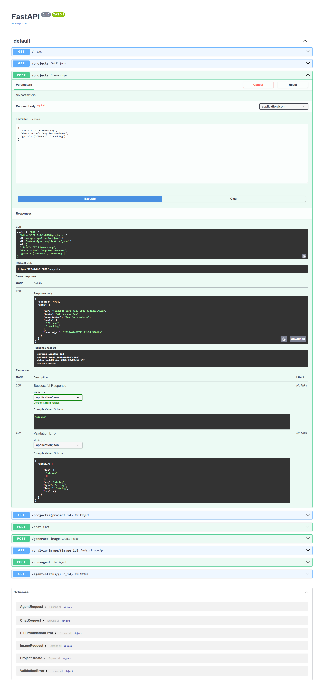
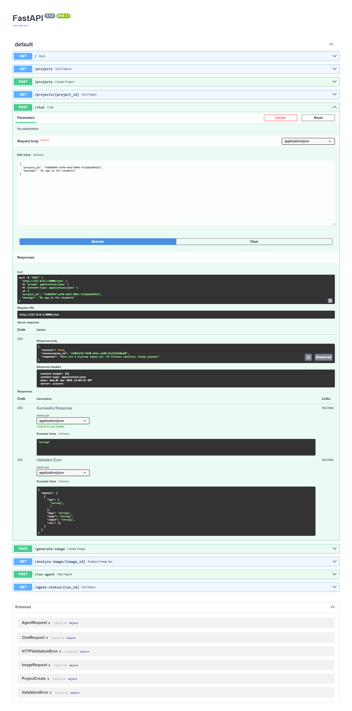
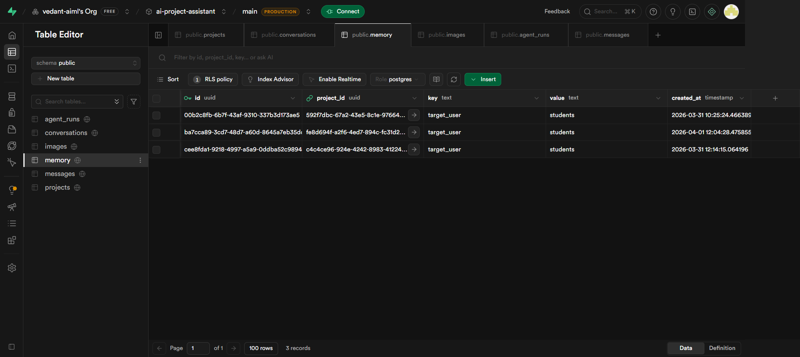
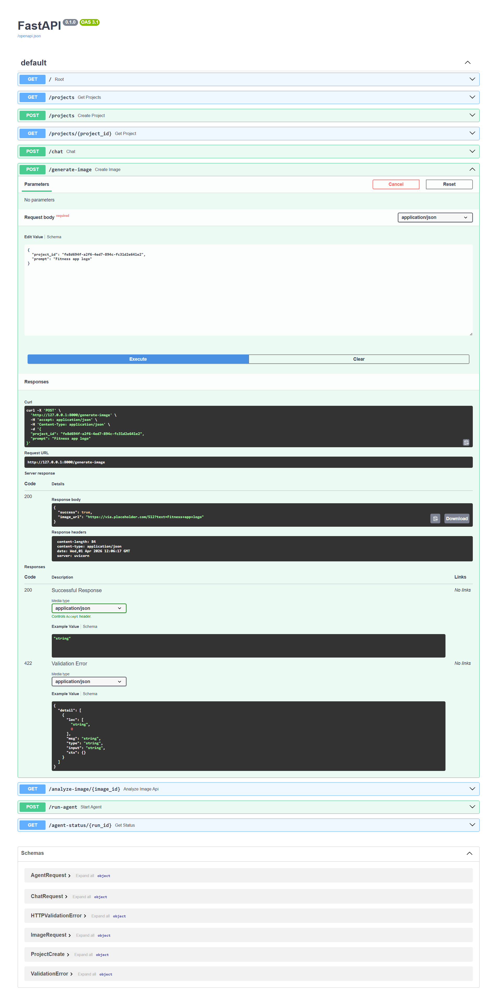
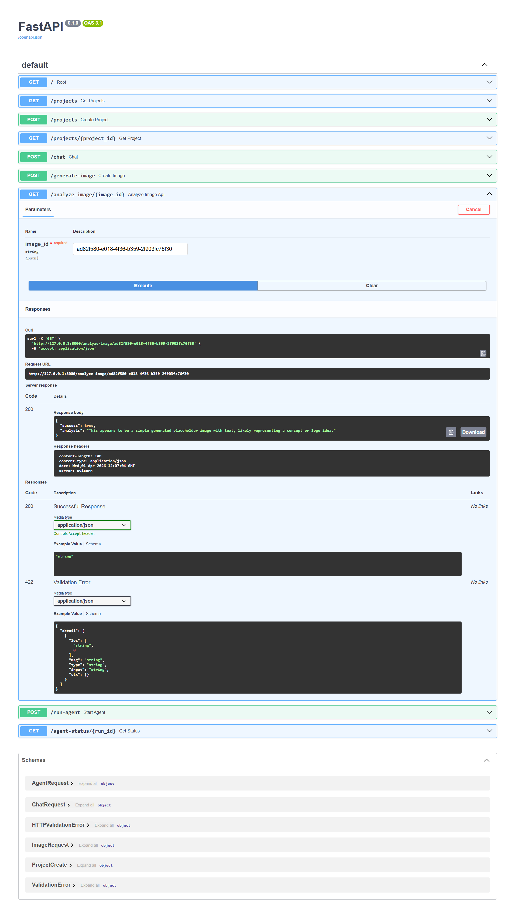
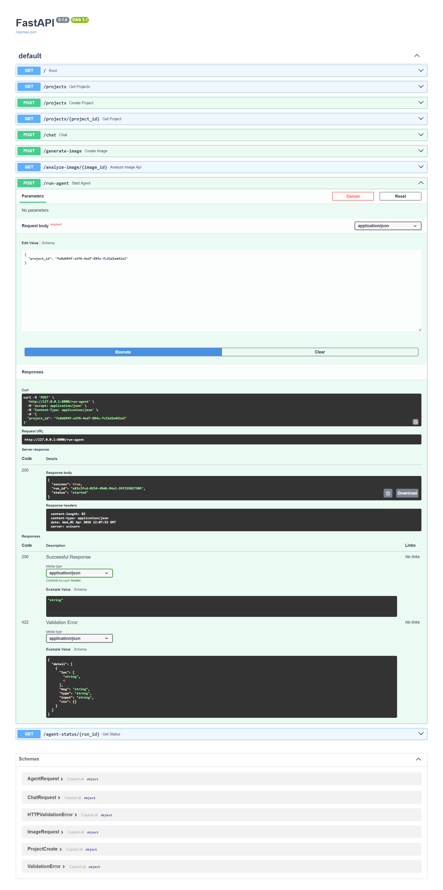
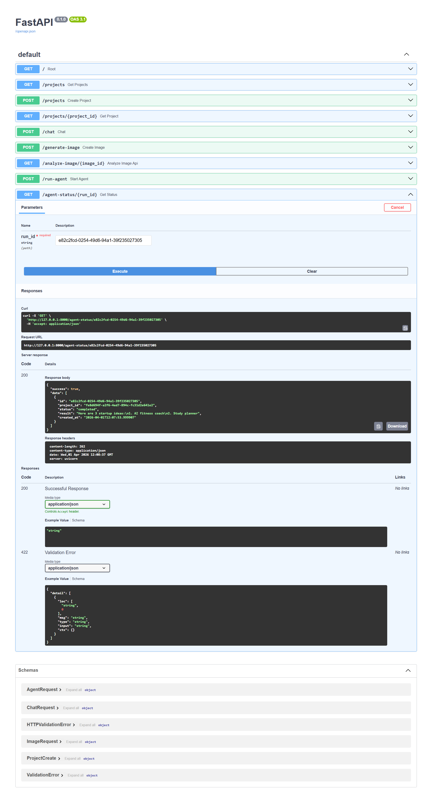

# 🤖 AI Project Assistant

An AI-powered backend system that combines chat, memory, image generation, and intelligent background agents to help users manage and explore project ideas.

---

### ⚡ Features
- 💬 AI Chat with memory (Claude)
- 🧠 Project-based memory system
- 🖼️ Image generation & analysis (Gemini)
- 🤖 Background agent for knowledge organization
- 🗂️ Structured project management

---

### 🛠️ Tech Stack
`Python` `FastAPI` `Supabase` `Claude API` `Gemini API` `AI Agents`

---

## 🧠 Overview

This project is designed as a modular AI assistant backend where users can:

- Chat with AI about their projects
- Store and retrieve conversations
- Generate and analyze images
- Maintain project-specific memory
- Run background agents to organize knowledge

---

## 🏗️ Tech Stack

- **Backend:** FastAPI (Python)
- **Database:** Supabase (PostgreSQL)
- **AI Chat:** Claude API
- **Image Analysis:** Gemini API
- **Image Generation:** Mock service
- **Architecture:** Modular (routes + services)

---

## 📁 Project Structure

app/
├── main.py
├── db.py
│
├── assets/                # Stored/generated images
│
├── routes/
│   ├── projects.py
│   ├── chat.py
│   ├── images.py
│   ├── agent.py
│
├── services/
│   ├── claude.py
│   ├── gemini.py
│   ├── memory.py
│   ├── image.py
│   ├── agent.py

---

## 🗄️ Database Schema Design

### Projects
Stores project-level metadata:
- id
- title
- description
- goals

### Conversations
- Linked to a project
- Represents chat sessions

### Messages
- Stores user and AI messages
- Linked to conversations

### Images
- Stores generated images
- Linked to project

### Memory
- Key-value store per project
- Used to improve AI responses

### Agent Runs
- Tracks background agent execution
- Fields:
  - status (pending, running, completed, failed)
  - result

---

## 🔌 API Endpoints

### 📁 Projects
- POST /projects → Create project
- GET /projects → List projects
- GET /projects/{id} → Get project

---

### 💬 Chat
- POST /chat → Chat with AI
- Stores messages in DB
- Injects memory into prompts

---

### 🖼️ Images
- POST /generate-image → Generate image
- GET /analyze-image/{id} → Analyze image

---

### 🤖 Agent
- POST /run-agent → Trigger background agent
- GET /agent-status/{run_id} → Check agent status

---

## 🧠 Memory System

- Memory is scoped per project
- Extracted from conversations
- Injected into Claude prompts

Example:

Key: target_user  
Value: students  

---

## 🤖 Agent System

The background agent:

1. Collects:
   - Messages
   - Images
   - Memory
2. Processes using AI
3. Generates structured insights
4. Stores results in database

Runs asynchronously using FastAPI BackgroundTasks.

---

## ⚙️ How to Run

### 1. Clone repository

git clone <repo-url>
cd ai-project-assistant

---

### 2. Create virtual environment

python -m venv aivenv  
source aivenv/bin/activate  
# Windows: aivenv\Scripts\activate  

---

### 3. Install dependencies

pip install -r requirements.txt

---

### 4. Setup environment variables

Create `.env` file:

SUPABASE_URL=your_url  
SUPABASE_KEY=your_key  
CLAUDE_API_KEY=your_key  
GEMINI_API_KEY=your_key  

---

### 5. Run server

uvicorn app.main:app --reload  

---

### 6. Open API docs

http://127.0.0.1:8000/docs  

---

## 🧪 Example Flow

1. Create a project  
2. Chat with AI  
3. Memory gets stored  
4. Generate an image  
5. Analyze image  
6. Run agent  
7. Retrieve structured output  

---

## 💡 Design Decisions

- Modular architecture for scalability
- Services layer separates business logic
- Memory improves contextual AI responses
- Agent system enables asynchronous processing
- Supabase simplifies backend + storage

---

## ⚠️ Notes

- Claude API can fallback if key is unavailable
- Image generation is mocked for simplicity
- Gemini used for analysis only

---

## 🎯 Assignment Coverage

✅ Chat system with memory  
✅ Project + schema design  
✅ Image generation & analysis  
✅ Background agent system  
✅ API design + modular architecture  

---

## 📸 Demo Screenshots

### 1️⃣ Create Project
Users can create a new project with title, description, and goals.

---

### 2️⃣ Chat with AI (Conversation Stored)
Users can interact with Claude AI, and all messages are stored in the database.

---

### 3️⃣ Memory Retrieval (Context Awareness)
The system retrieves project-specific memory before responding, improving AI accuracy.

---

### 4️⃣ Generate Image
Users can generate images based on prompts within the project context.

---

### 5️⃣ Analyze Image
AI analyzes generated or uploaded images using Gemini API.

---

### 6️⃣ Run Background Agent (Core Feature)
The agent processes all project data (messages, images, memory) and generates structured insights.

---

### 7️⃣ Check Agent Status
Users can track the execution status of the background agent (pending, running, completed).

---

## 👨‍💻 Author

**Vedant Shinde**  
Machine Learning & Generative AI Enthusiast  

🔗 GitHub: https://github.com/vedant-aiml